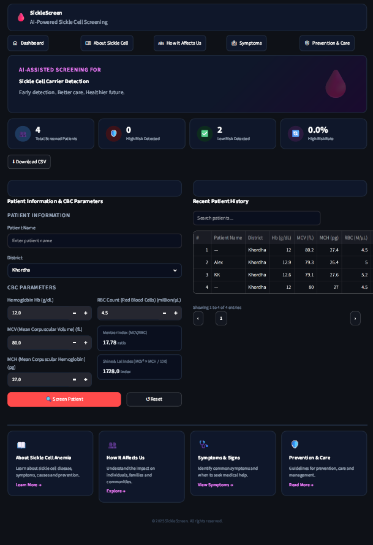
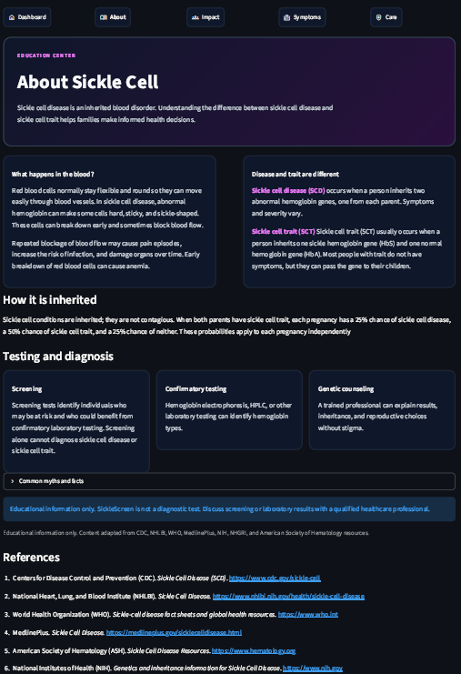
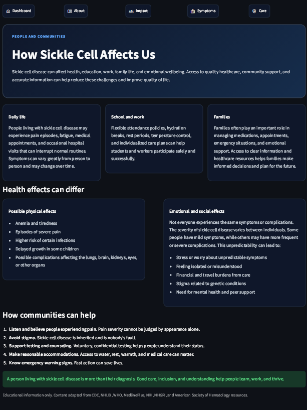
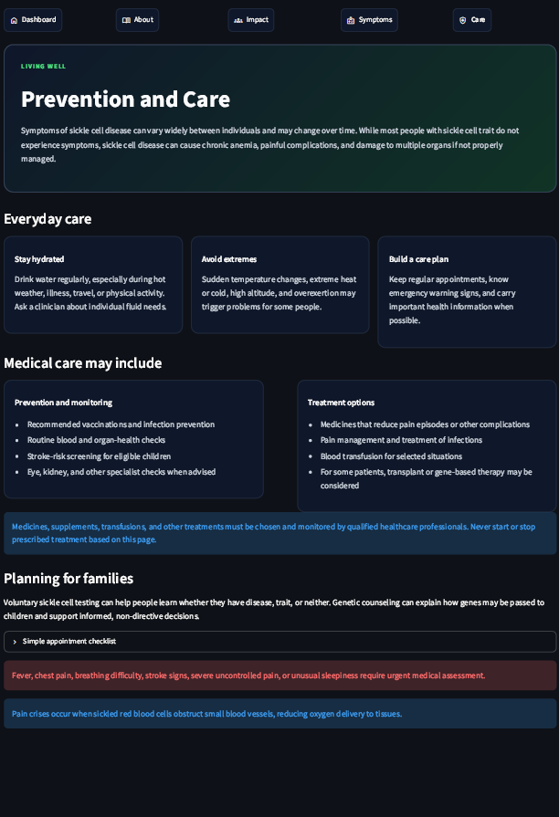
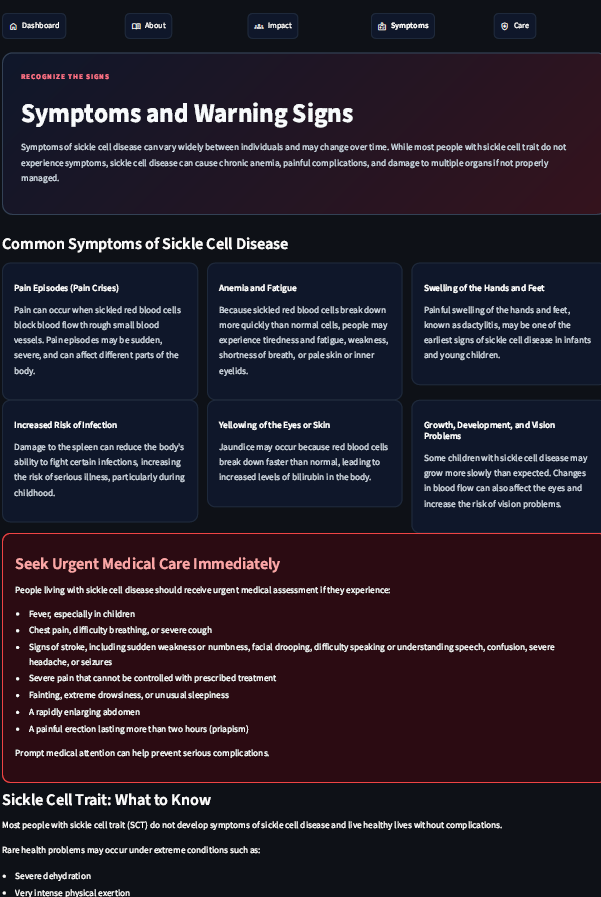
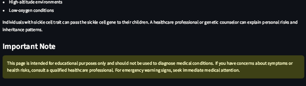

# 🩸 SickleScreen

### AI-Assisted Sickle Cell Carrier Screening for Frontline Health Workers

> **"Identify potential sickle cell carriers in 60 seconds — using blood reports they already have."**

---

# 📌 The Problem

Sickle cell disease (SCD) is one of the most prevalent inherited blood disorders in India, disproportionately affecting tribal communities across Odisha, Chhattisgarh, Madhya Pradesh, Maharashtra, and Gujarat.

India contributes a significant share of the global sickle cell burden, with millions of individuals carrying the sickle cell trait. Despite the Government of India's **National Sickle Cell Anaemia Elimination Mission 2047**, early detection at the community level remains challenging.

Key barriers include:

* ❌ Lack of accessible digital screening tools for frontline healthcare workers
* ❌ Limited availability of confirmatory testing such as HPLC and hemoglobin electrophoresis
* ❌ Underutilization of routine CBC (Complete Blood Count) reports generated at Primary Health Centres
* ❌ Missed opportunities for early identification and genetic counseling

**SickleScreen aims to bridge this gap.**

---

# 💡 What Is SickleScreen?

SickleScreen is a mobile-friendly Streamlit application that analyzes routinely collected CBC parameters and generates a machine-learning-based risk assessment for sickle cell carrier status.

The application is designed for:

* ASHA Workers
* Primary Health Centre Staff
* Community Health Workers
* Rural Screening Programs

The system produces an easy-to-understand triage recommendation:

| Risk Score | Status     | Action                              |
| ---------- | ---------- | ----------------------------------- |
| < 30%      | 🟢 CLEAR   | Low likelihood of carrier status    |
| 30–70%     | 🟡 MONITOR | Follow-up testing recommended       |
| > 70%      | 🔴 REFER   | Prioritize for confirmatory testing |

In addition, the platform displays the nearest available referral center based on the selected district.

---

# 📸 Application Features

### 🏠 Patient Screening Dashboard

* Patient demographic capture
* CBC parameter input
* Automatic feature engineering
* Instant risk scoring

### 🩺 Clinical Risk Assessment

* Machine learning prediction engine
* Color-coded triage recommendations
* Referral center suggestions
* Historical patient tracking

### 📖 Educational Resource Center

Dedicated public-health education modules covering:

* About Sickle Cell Disease
* Community Impact
* Symptoms & Warning Signs
* Prevention & Care

---

# 🧬 Scientific Background

Sickle cell carriers and affected individuals may exhibit characteristic hematological patterns.

| Parameter       | Typical Range | Potential Carrier Pattern |
| --------------- | ------------- | ------------------------- |
| Hemoglobin (Hb) | 12–16 g/dL    | Mildly reduced            |
| MCV             | 80–100 fL     | Often reduced             |
| MCH             | 27–32 pg      | Often reduced             |
| RBC Count       | 4–5.5 M/µL    | Low-normal to reduced     |

To improve classification performance, SickleScreen automatically calculates two hematological indices:

### Mentzer Index

[
Mentzer\ Index = \frac{MCV}{RBC}
]

### Shine-Lal Index

[
Shine\text{-}Lal\ Index = \frac{MCV^2 \times MCH}{100}
]

These engineered features are combined with CBC parameters to power the machine learning classifier.

---

# 🧠 Machine Learning Pipeline

### Dataset Development

* Synthetic clinical dataset generated from distributions reported in Indian hematology literature and public health resources
* 500 patient profiles used for model development

### Model

* Random Forest Classifier
* 100 estimators
* Random state = 42

### Training Framework

* Stratified 80/20 train-test split
* Probability-based risk prediction
* Triage-focused thresholding

### Feature Inputs

1. Hemoglobin (Hb)
2. MCV
3. MCH
4. RBC Count
5. Mentzer Index
6. Shine-Lal Index

---

# 🖥️ System Architecture

## 1. Screening Dashboard (`app.py`)

Core production interface responsible for:

* Patient data capture
* CBC feature processing
* Model inference
* Referral center mapping
* Historical patient logging

## 2. Educational Modules

### About_Sickle_Cell.py

* Disease overview
* Inheritance patterns
* Myth versus fact education

### How_It_Affects_Us.py

* Community impact
* Social and emotional considerations
* Emergency warning signs

### Symptoms.py

* Common symptoms
* Medical red flags
* Trait versus disease distinctions

### Prevention_and_Care.py

* Prevention strategies
* Family planning information
* Care management guidance

---

# 📸 Application Preview

The following screenshots demonstrate the final SickleScreen user experience.

---

## 🏠 Dashboard & Patient Screening



The primary screening dashboard used by frontline healthcare workers to enter patient information, CBC parameters, and receive instant AI-assisted risk assessments.

---

## 📖 About Sickle Cell Disease



Educational module explaining sickle cell disease, inheritance patterns, carrier status, testing methods, and common myths.

---

## 🌍 How Sickle Cell Affects Communities



Community-focused educational page covering social impact, emotional wellbeing, stigma reduction, and support strategies.

---

## ❤️ Prevention & Care



Evidence-based recommendations covering hydration, infection prevention, family planning, genetic counseling, and long-term disease management.

---

## 🚨 Symptoms & Warning Signs

### Symptoms Overview



Overview of common symptoms including pain crises, anemia, fatigue, swelling, infections, and jaundice.

### Emergency Warning Signs



Critical warning signs requiring urgent medical attention, including stroke symptoms, chest pain, severe infections, and other medical emergencies.

---

# 🗂️ Project Structure

```text
SickleScreen/
│
├── app.py
│
├── pages/
│   ├── About_Sickle_Cell.py
│   ├── How_It_Affects_Us.py
│   ├── Symptoms.py
│   └── Prevention_and_Care.py
├──Reference/
│   ├── aboutsicklecell.png
│   ├── dash.png
│   ├── prevention.png
│   ├── sicklecellaffectsus.png
│   ├── Symp1.png
│   └── Symp2.png
│
├── samfile1.py
├── samfile2.py
│
├── sicklescreen_best_model.pkl
├── sicklescreen_raw_data.csv
├── patient_history.csv
│
├── LICENSE.txt
└── README.md
```

---

# 🏥 Referral Database (Current Coverage)

| District   | Referral Centre                |
| ---------- | ------------------------------ |
| Khordha    | Capital Hospital, Bhubaneswar  |
| Koraput    | District Headquarters Hospital |
| Sundargarh | IGH Rourkela                   |
| Cuttack    | SCB Medical College            |

# ⚙️ Setup & Installation

```bash
# Clone repository
git clone https://github.com/your-username/SickleScreen.git

cd SickleScreen

# Create virtual environment
python -m venv .venv

# Activate environment
# Windows
.venv\Scripts\activate

# Linux / macOS
source .venv/bin/activate

# Install dependencies
pip install streamlit pandas numpy scikit-learn joblib

# Optional: retrain model
python samfile1.py

# Launch application
python -m streamlit run app.py
```

The application will start locally at:

```text
http://localhost:8501
```

---

# 🎯 Impact & Vision

* Designed to support frontline health workers operating in resource-limited settings
* Leverages CBC reports already generated in routine healthcare workflows
* Requires no specialized laboratory infrastructure for initial risk assessment
* Supports awareness and screening efforts aligned with India's National Sickle Cell Anaemia Elimination Mission 2047

---

# 📚 Educational References

Educational content was developed using information from:

* Centers for Disease Control and Prevention (CDC)
* National Heart, Lung, and Blood Institute (NHLBI)
* National Institutes of Health (NIH)
* World Health Organization (WHO)
* MedlinePlus
* American Society of Hematology (ASH)

---

# 👥 Team
### Sampriti Halder

* Biological research
* Clinical validation design
* Reference dataset engineering
* Machine learning pipeline development
* Statistical evaluation
### Duradarshee Chinara

* Full-stack application development
* Streamlit UI/UX architecture
* Model integration
* Referral center mapping
* Educational portal development


---

# ⚠️ Disclaimer

SickleScreen is intended solely for educational, research, and screening purposes.

The application does **not** diagnose sickle cell disease or sickle cell trait and should not be used as a substitute for professional medical advice, diagnosis, or treatment.

Individuals identified as potentially at risk should undergo confirmatory testing, such as hemoglobin electrophoresis or HPLC, and consult qualified healthcare professionals.

---

# 📄 License

Copyright © 2026 Duradarshee Chinara and Sampriti Halder.

All Rights Reserved.

This project, including its source code, machine learning models, datasets, documentation, and associated materials, may not be copied, modified, distributed, published, sublicensed, or commercially used without prior written permission from the copyright holders.
